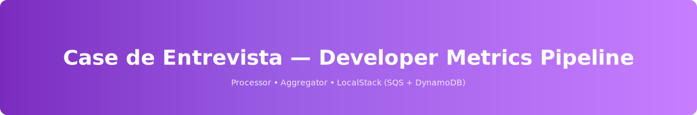

# Case de Entrevista

<p align="center">
	
</p>

Este repositório contém uma aplicação de estudo com dois serviços em Go que se comunicam via AWS SQS e DynamoDB simulados pelo LocalStack.

## Visão geral

- `processor`: consome mensagens da fila `raw-events`, valida e enriquece o evento, publica resultados na fila `processed-events`.
- `aggregator`: consome mensagens da fila `processed-events`, grava eventos em DynamoDB e expõe uma API HTTP para leitura de métricas.
- `LocalStack`: emula AWS SQS e DynamoDB localmente, sem precisar da AWS real.

## Pré-requisitos

Antes de rodar o projeto, instale:

- `Docker Desktop` (Windows/Mac/Linux) com `docker` e `docker-compose` funcionando.
- `Go 1.21` ou superior.
- `AWS CLI` para o script de seed local.
- `git` para clonar este repositório.

> No Windows, recomendamos usar Git Bash ou PowerShell. Em Git Bash, os comandos `bash` funcionam melhor com este projeto.

## Instalação

1. Clone o repositório:

```bash
cd /c/Users/rubens/git
git clone <url-do-repo> case
cd case
```

2. Verifique as versões:

```bash
docker --version
docker compose version
go version
aws --version
```

Nota rápida sobre dependências Go
--------------------------------

Antes de rodar `docker compose up --build`, atualize os módulos Go em todos os serviços a partir da raiz:

Bash / Git Bash:

```bash
for d in services/*; do [ -f "$d/go.mod" ] && (cd "$d" && go mod tidy); done
```


Depois execute:

```bash
docker compose up --build
```

3. Confirme que o `docker-compose.yml` existe na raiz e que o `scripts/seed.sh` está presente.

## Como rodar o ambiente

### 1) Subir o ambiente completo

```bash
docker compose up --build
```

Isso sobe:

- `localstack` (SQS + DynamoDB)
- `processor`
- `aggregator`

### 2) Subir sem rebuild

```bash
docker compose up
```

### 3) Parar e limpar

```bash
docker compose down -v
```

## Seed de dados

O seed publica mensagens de teste em `raw-events`.

```bash
chmod +x scripts/seed.sh && ./scripts/seed.sh
```

A partir de 2026-05-24, o script já define credenciais padrão do LocalStack se elas não estiverem presentes, então você não precisa configurar AWS keys manualmente.

### Se houver erro `NoCredentials`

No Windows PowerShell:

```powershell
$env:AWS_ACCESS_KEY_ID = "test"
$env:AWS_SECRET_ACCESS_KEY = "test"
./scripts/seed.sh
```

No Git Bash:

```bash
export AWS_ACCESS_KEY_ID=test
export AWS_SECRET_ACCESS_KEY=test
Bash / Git Bash (cole os comandos abaixo um a um):

```bash
cd services/processor && go mod tidy
cd ../aggregator && go mod tidy
cd ../..
```

PowerShell (cole os comandos abaixo um a um):

```powershell
Push-Location services/processor; go mod tidy; Pop-Location
Push-Location ..\aggregator; go mod tidy; Pop-Location
```

Depois execute:

```bash
docker compose up --build
```
```json
{"dynamodb":"ok","sqs":"ok","status":"ok"}
```

### Endpoints de métricas

```bash
curl -s http://localhost:8080/metrics/dev-alice
curl -s http://localhost:8080/metrics/dev-bob
curl -s http://localhost:8080/metrics/dev-alice/summary
curl -s http://localhost:8080/metrics/dev-bob/summary
```

Se tudo estiver funcionando e o seed já tiver processado dados, estes endpoints devem retornar eventos e resumo não vazios.

### Validação sem Make

Use os mesmos endpoints da aplicação diretamente com `curl`:

- `curl -s http://localhost:8080/health`
- `curl -s http://localhost:8080/metrics/dev-alice`
- `curl -s http://localhost:8080/metrics/dev-bob`
- `curl -s http://localhost:8080/metrics/dev-alice/summary`
- `curl -s http://localhost:8080/metrics/dev-bob/summary`

> O Makefile ainda existe como opção, mas você não precisa dele para executar ou validar o projeto.

### Inspeção direta do LocalStack

Dentro do container LocalStack você pode ver as filas e tabelas:

```bash
docker exec localstack bash -lc 'awslocal sqs get-queue-attributes --queue-url http://localhost:4566/000000000000/raw-events --attribute-names ApproximateNumberOfMessages ApproximateNumberOfMessagesNotVisible'
```

```bash
docker exec localstack bash -lc 'awslocal dynamodb scan --table-name developer_summary --select ALL_ATTRIBUTES'
```

## Rodando testes

### Todos os testes do processor

```bash
cd services/processor && go test ./... -v
```

### Todos os testes do aggregator

```bash
cd services/aggregator && go test ./...
```

### Testes específicos (comentados no Makefile)

```bash
cd services/processor && go test ./internal/integration -run TestDLQ_MessagesMovedAfterMaxReceive -v
```

```bash
cd services/processor && go test ./internal/infra/worker -run TestWorkerPool_ProcessesConcurrently -v
```

> Nota: para validar o fluxo do `aggregator`, acima dos testes do `processor` é necessário que o `aggregator` esteja gravando corretamente no DynamoDB.
> A correção de código que fez o fluxo funcionar foi feita em `services/aggregator/internal/domain/event.go`, adicionando tags `dynamodbav` ao struct `ProcessedEvent`. Isso permite que o AWS SDK faça o marshaling correto dos campos para o DynamoDB e evita o erro de `ValidationException` por chave obrigatória ausente.

## Estrutura do projeto

- `docker-compose.yml`: orquestra `localstack`, `processor` e `aggregator`.
- `infra/localstack/init-aws.sh`: cria filas SQS e tabelas DynamoDB dentro do LocalStack.
- `scripts/seed.sh`: publica mensagens de teste no LocalStack.
- `services/processor`: serviço que processa eventos brutos.
- `services/aggregator`: serviço que agrega eventos e expõe API de métricas.
- `Makefile`: comandos de desenvolvimento e validação opcionais.

## Observações importantes

- O `seed.sh` depende do AWS CLI e do LocalStack rodando.
- O `processor` e o `aggregator` usam credenciais AWS fixas (`test/test`) para se conectar ao LocalStack.
- O endpoint `/metrics/{developer_id}` retorna `[]` quando não há eventos processados.
- O endpoint `/metrics/{developer_id}/summary` retorna `developer não encontrado` quando não há resumo no DynamoDB.

